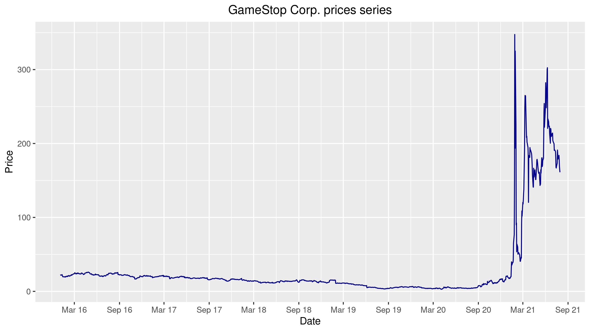

# Stock Analysis with R

Using R to gain stock data and using R libraries to analyze and plot the data.   

Using quantmod to get the data from Yahoo Finance. 

Using ggplot2 to plot the data.

Looking to expand to analysis, currently the script only gets the data and plots it. 

## Example of the program:

Using R to gain the data from yahoo finance and plotting it.

